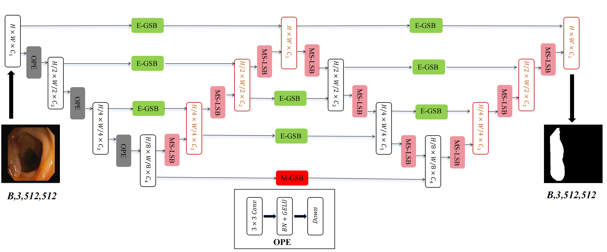

# WNet2D

**WNet2D** is a lightweight **dual-path** medical image segmentation model featuring:
- **MS-LSB (Multi-Scale Local Scope Block):** dilated convolutions to enhance shallow edge/texture details.
- **E-GSB (Enhanced Global Scope Block):** parallel 3×3 / 5×5 / 7×7 average pooling branches, followed by a 1×1 conv and a lightweight MLP (GELU) in a residual design to improve global semantic consistency.
- **Mamba SSM (deepest stage):** efficient and stable long-range dependency modeling with low compute.

> **Status — staged release:** this repository currently provides the **reference model implementation** and a **minimal inference demo** for inspection and quick sanity checks. **Training/evaluation scripts and pretrained checkpoints will be added in a subsequent update** (see *Roadmap*).

---

## 🖼️ Model Overview

<p align="center">
  
</p>

---

## 📂 Project Structure

WNet2D/
├─ README.md
├─ model.py # WNet2D with MS-LSB / E-GSB / Mamba SSM (minimal reference)
├─ demo_infer.py # 10-line forward pass demo (1×3×512×512)
└─ architecture.png # model diagram used in the paper/README

## 💻 Environment & Installation

**Tested environment (paper reference):**
- **Hardware:** NVIDIA GeForce RTX 4090 (22.15 GB VRAM), x86_64 CPU (8 cores), 15.57 GB RAM  
- **OS:** Ubuntu 22.04 (Linux 6.5.0-28)  
- **Software:** Python 3.9.23, PyTorch 2.1.2 (CUDA 11.8), cuDNN 8.7

**Quick install (example):**
```bash
# (Optional) create a virtual env
conda create -n wnet2d python=3.9 -y
conda activate wnet2d

# Install PyTorch (choose the CUDA build that matches your system from the official PyTorch site)
pip install torch==2.1.2

# Common deps (minimal; extend as needed)
pip install numpy opencv-python scikit-image scipy tqdm einops
# (Optional) if you plan to use Mamba SSM:
# pip install mamba-ssm
🚀 Quick Start (Minimal Inference)
Run a single forward pass with a 512×512 tensor (no dataset required):

bash

python demo_infer.py
# Expected: prints input/output tensor shapes, e.g., (1, 3, 512, 512) -> (1, 1, 512, 512)
(Optional) Load weights
When checkpoints are released, you can load them in demo_infer.py:

python

ckpt = torch.load("wnet2d_xxx.pth", map_location="cpu")
model.load_state_dict(ckpt, strict=False)
📊 Datasets
The paper uses four public datasets: Kvasir-SEG, ISIC 2017, DRIVE, and PH2.
This repository does not redistribute raw data. Please download them from their official sources and follow their licenses/terms.

📏 Reproducibility Protocol (Measurement)
To keep consistency with the paper:

FLOPs are reported as 2 × MACs for an input 1×3×512×512.

Latency & Peak Memory are measured in model.eval() with batch size = 1, FP32.
Use 50 warm-up runs and report the average of 200 timed runs using CUDA events, with torch.cuda.synchronize() between runs, on a single RTX 4090.

⚡ Efficiency Summary (from the paper)
As summarized from Table 3 and Figure 7:

Parameters: ~4M (≈57% of nnWNet), fewer than most Conv/Hybrid baselines (e.g., BCU-Net, CMU-Net, UCTransNet).

FLOPs: ~30M per 512×512 image — 30% lower than nnWNet (43M), and far below BCU-Net (454M) and TransAttUNet (356M).

Latency / Memory:

nnU-Net: Lowest latency (3.77 ms) and peak memory (0.82 GB), but lower segmentation accuracy on multiple datasets.

WNet2D: 14.19 ms latency and 2.54 GB peak memory, offering a practical balance between speed, memory, and segmentation accuracy.

Overall, WNet2D combines strong parameter/compute efficiency with competitive latency/memory, suitable for resource-constrained deployments.

🗺️ Roadmap
v1.0.0 (current): Reference model + minimal inference demo + measurement protocol.

v1.1.0 (planned): Training/evaluation scripts and config examples for Kvasir-SEG / ISIC 2017 / DRIVE / PH2.

v1.2.0 (planned): Pretrained checkpoints and reproducibility logs; FLOPs/latency scripts.

If you need a particular script first, please open an issue and we’ll prioritize it.

📄 License
Released under MIT (or Apache-2.0). See LICENSE for details.
Disclaimer: This software is for research use only and not for clinical decision-making.
